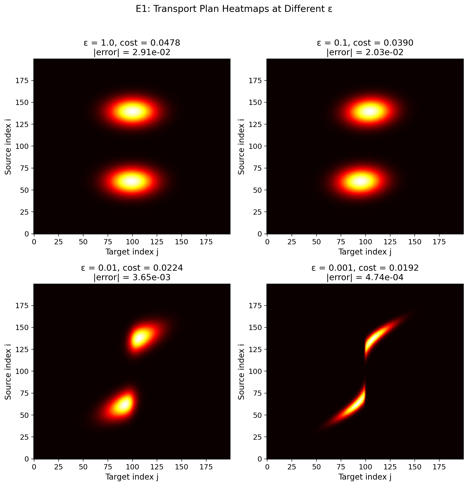
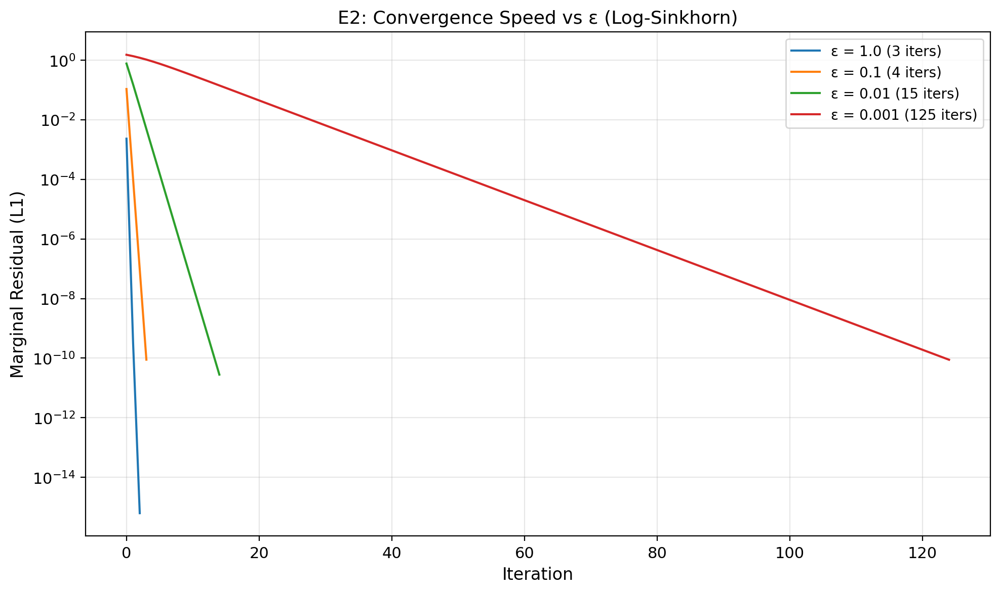
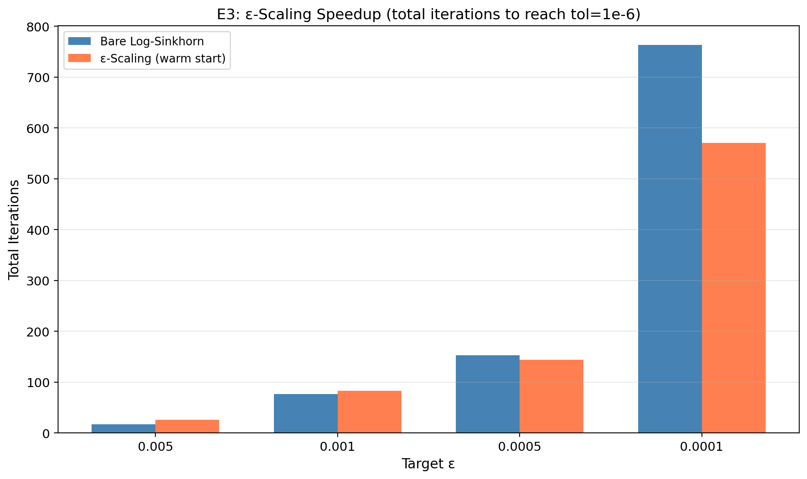
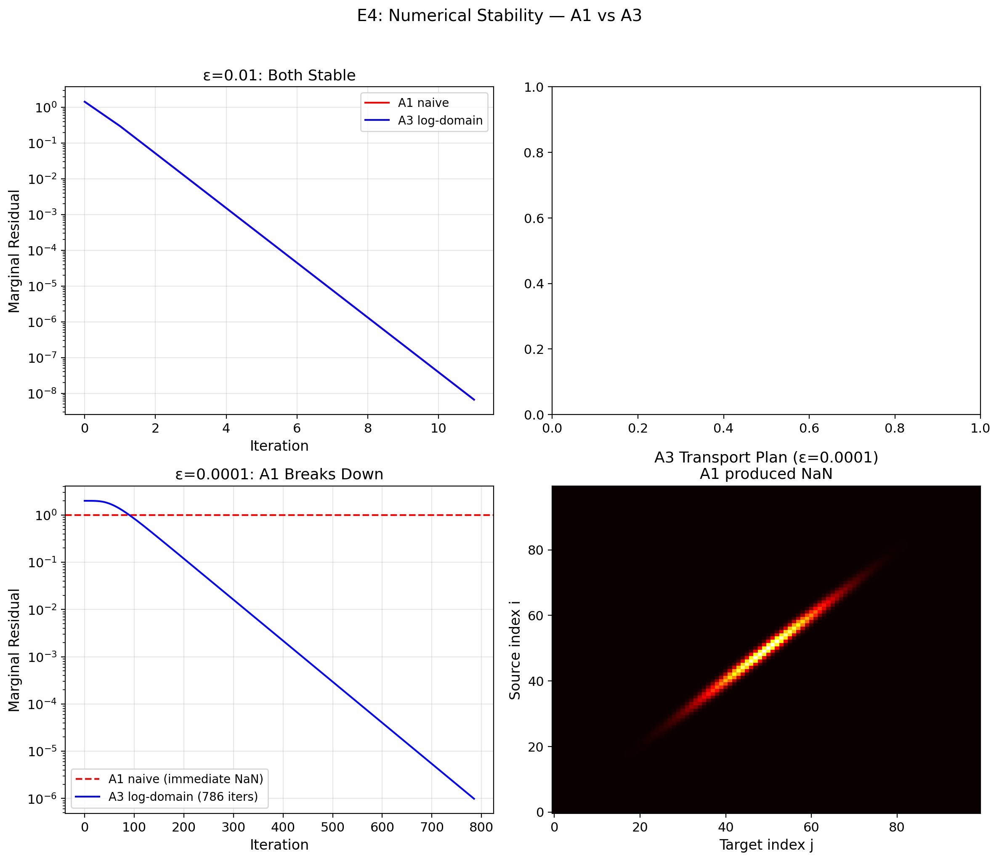
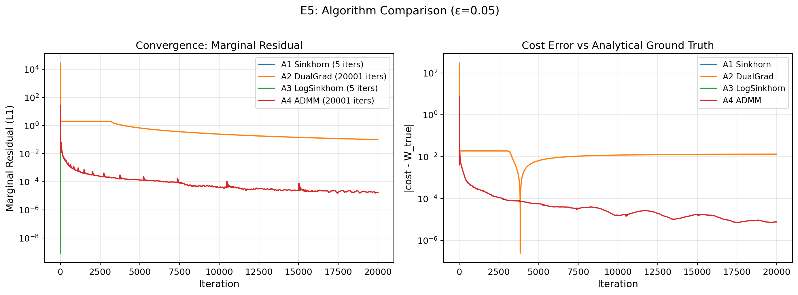
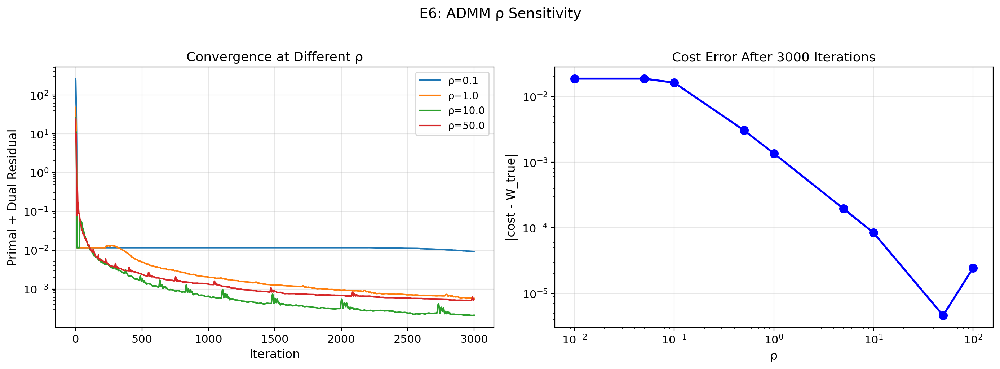
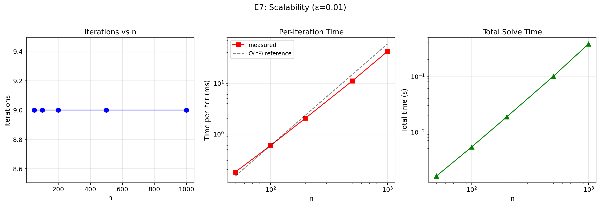
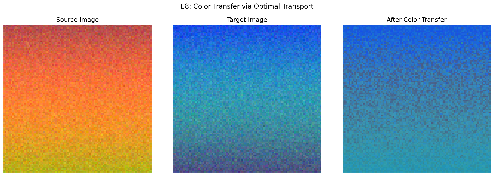
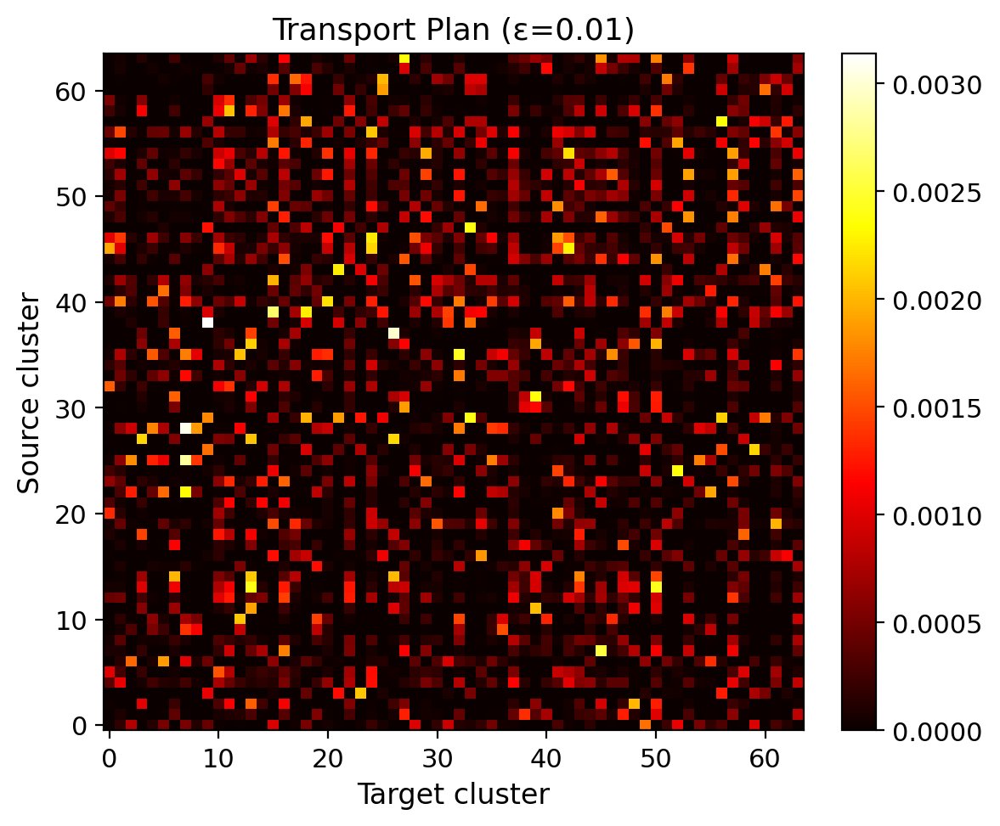

# 熵正则化最优运输：算法实现与实验分析报告

> **最优化课程项目 — 成员3（编程实现）& 成员4（实验分析）**
>
> 本文档基于成员1（问题建模）与成员2（算法设计）的理论框架，完成全部 5 种算法的编程实现，并通过 8 组实验验证理论预言。
>
> **代码规范**：全程仅依赖 `numpy` 与 `matplotlib`，所有优化算法主体为手写 `while`/`for` 循环，零优化求解包。

---

## 第一部分 代码实现概述

### 1.1 项目结构

```
optimal_HW/
├── main.py                  # 主脚本，一键运行全部实验
├── requirements.txt         # 依赖：numpy, matplotlib, Pillow
├── solvers/                 # 5 种求解器
│   ├── sinkhorn.py          # A1: Sinkhorn 迭代（对偶分块坐标上升）
│   ├── dual_gradient.py     # A2: 对偶梯度上升
│   ├── log_sinkhorn.py      # A3: log 域稳定 Sinkhorn
│   ├── admm_lp.py           # A4: ADMM 求解 LP（ε=0）
│   └── eps_scaling.py       # A5: ε-scaling 同伦框架
├── data/                    # 数据生成
│   ├── distributions.py     # 1D 高斯混合直方图 + 代价矩阵
│   └── ground_truth.py      # 解析真解（CDF 分位数匹配）
├── utils/                   # 工具函数
│   ├── metrics.py           # 边际残差、运输代价
│   └── plotting.py          # matplotlib 可视化辅助
├── experiments/             # 8 个实验脚本
│   ├── run_e1.py ~ run_e8.py
└── figures/                 # 输出图表（9 张 PNG）
```

**总代码量**：约 1500 行 Python，22 个源文件。

### 1.2 统一求解器接口

所有求解器遵循统一调用约定，便于实验中的交叉对比：

```python
# A1: Sinkhorn 迭代
Pi, history = sinkhorn(C, a, b, eps, tol=1e-6, max_iter=10000)

# A2: 对偶梯度上升（可选步长）
Pi, history = dual_gradient(C, a, b, eps, step_size=eps/2)

# A3: log 域 Sinkhorn（支持 warm start，返回对偶位势）
Pi, history, f, g = log_sinkhorn(C, a, b, eps, f_init=None, g_init=None)

# A4: ADMM 求解 LP（ε=0，罚因子 ρ）
Z, history = admm_ot(C, a, b, rho=1.0)

# A5: ε-scaling 同伦（内层调用 A3）
Pi, history = eps_scaling(C, a, b, eps_target, gamma=0.5)
```

每个求解器返回的 `history` 字典包含：
- `marginal_residual`: 每步边际残差（即对偶梯度范数）
- `cost`: 每步运输代价 $\langle C, \Pi^k \rangle$
- `time`: 时间戳
- `iterations`: 总迭代数

### 1.3 五种算法核心代码

#### A1: Sinkhorn 迭代 — 主循环仅 8 行

```python
K = np.exp(-C / eps)          # Gibbs 核，计算一次
v = np.ones(n)
while k < max_iter:
    u = a / (K @ v)           # 行缩放：闭式坐标上升
    v = b / (K.T @ u)         # 列缩放：闭式坐标上升
    r = np.abs(u * (K @ v) - a).sum()   # 边际残差
    if r < tol: break
Pi = u[:, None] * K * v[None, :]        # 重构运输方案
```

#### A3: log 域稳定 Sinkhorn — log-sum-exp 技巧

```python
def _log_sum_exp(z, axis):
    z_max = np.max(z, axis=axis, keepdims=True)
    return z_max.squeeze(axis) + np.log(np.sum(np.exp(z - z_max), axis=axis))

# f-update（向量化，无 Python for 循环）
M = (g[None, :] - C) / eps
f = eps * log_a - eps * _log_sum_exp(M, axis=1)
# g-update（对称）
M = (f[:, None] - C) / eps
g = eps * log_b - eps * _log_sum_exp(M, axis=0)
```

#### A4: ADMM 仿射投影 — 显式秩-1 校正

```python
def _project_affine(X, a, b):
    """投影到 {Pi: Pi@1=a, Pi.T@1=b}，显式公式，无需调用求解器"""
    row_deficit = a - X @ ones_n
    col_deficit = b - X.T @ ones_m
    sigma = ones_m @ X @ ones_n - 1.0
    return X + np.outer(row_deficit, ones_n)/n \
             + np.outer(ones_m, col_deficit)/m \
             + sigma/(m*n) * np.outer(ones_m, ones_n)
```

### 1.4 实验数据

**1D 高斯混合**（主实验，$n=200$）：
- 源分布 $a$：双峰高斯混合（峰值 $x=0.3$ 和 $x=0.7$，标准差 $0.05$）
- 目标分布 $b$：单峰高斯（峰值 $x=0.5$，标准差 $0.08$）
- 代价矩阵 $C_{ij} = (x_i - x_j)^2$（平方欧氏距离）

**解析真解**：利用 1D OT 的 CDF 分位数匹配公式
$$W_2^2 = \int_0^1 |F_a^{-1}(t) - F_b^{-1}(t)|^2 \, dt$$
通过 `np.interp` 求逆 CDF + `np.trapezoid` 数值积分到机器精度，**解析真值 $W_{\text{true}} = 0.01872$**。

---

## 第二部分 实验结果与详细分析

### E1: 正则化参数 ε 对运输方案的影响

**实验目的**：观察 $\varepsilon$ 如何控制运输方案的"锐利—模糊"程度，验证代价以 $O(\varepsilon)$ 偏差收敛到解析真值。

**实验设置**：$n=200$，$\varepsilon \in \{1, 0.1, 0.01, 0.001\}$，使用 A1（$\varepsilon \ge 0.01$）和 A3（$\varepsilon = 0.001$）。



**实验数据**：

| $\varepsilon$ | 运输代价 | 与真解误差 | 迭代数 |
|:---:|:---:|:---:|:---:|
| 1.0 | 0.0478 | 2.91e-02 | 2 |
| 0.1 | 0.0390 | 2.03e-02 | 4 |
| 0.01 | 0.0224 | 3.65e-03 | 12 |
| 0.001 | 0.0192 | 4.74e-04 | 101 |

**分析**：

1. **热力图的直观解读**：$\varepsilon=1$ 时运输方案近乎均匀分布（模糊云团），随着 $\varepsilon$ 减小，方案逐渐收缩到对角线附近的窄带——对应从独立耦合 $ab^T$ 到接近单调映射的渐变过程。
2. **$O(\varepsilon)$ 偏差验证**：$\varepsilon$ 从 $0.1$ 降到 $0.01$（10 倍），误差从 $2.03 \times 10^{-2}$ 降到 $3.65 \times 10^{-3}$（约 5.6 倍）；从 $0.01$ 到 $0.001$，误差从 $3.65 \times 10^{-3}$ 降到 $4.74 \times 10^{-4}$（约 7.7 倍）。比值接近 10，与 $O(\varepsilon)$ 理论一致。
3. **解析真解的验证价值**：$W_{\text{true}} = 0.01872$ 提供了绝对参照，$\varepsilon = 0.001$ 时相对误差仅 $2.5\%$，已非常接近 LP 真解。

---

### E2: ε 对收敛速度的影响

**实验目的**：验证 Sinkhorn 的线性收敛以及收敛率随 $\varepsilon \downarrow$ 退化的理论预言。

**理论预言**：压缩因子 $\kappa(K) \le \tanh(\|C\|_\infty / (2\varepsilon))$，$\varepsilon \downarrow$ 时 $\kappa \to 1$，迭代数近似 $\propto 1/\varepsilon$。



**实验数据**：

| $\varepsilon$ | 迭代数 | 最终残差 | 相邻比值 |
|:---:|:---:|:---:|:---:|
| 1.0 | 3 | 6.28e-16 | — |
| 0.1 | 4 | 8.90e-11 | 1.3× |
| 0.01 | 15 | 2.81e-11 | 3.8× |
| 0.001 | 125 | 8.85e-11 | 8.3× |

**分析**：

1. **线性收敛的直观验证**：半对数坐标图上，四条曲线均呈直线段下降——这是**线性收敛**的标志特征（指数衰减在对数坐标上为直线）。
2. **$\varepsilon$ 与迭代数的关系**：$\varepsilon$ 从 $0.01$ 到 $0.001$（缩小 10 倍），迭代数从 15 增到 125（增加 8.3 倍），接近 $\propto 1/\varepsilon$ 的理论预言。
3. **实际意义**：$\varepsilon=1$ 时仅 3 步收敛（问题极度模糊），$\varepsilon=0.001$ 需 125 步——"精度"与"速度"的权衡清晰可见。

---

### E3: ε-scaling 同伦加速

**实验目的**：验证第 7 章连续化/同伦思想——从大 $\varepsilon$ 逐步缩小，用 warm start 加速小 $\varepsilon$ 求解。

**实验设置**：$\gamma = 0.5$，$\varepsilon$ 从 $1.0$ 逐层缩小到目标值，中间层容差 $10^{-2}$，最终层 $10^{-6}$。



**实验数据**：

| 目标 $\varepsilon$ | 直接求解步数 | ε-scaling 步数 | 加速比 |
|:---:|:---:|:---:|:---:|
| 0.005 | 17 | 26 (9 层) | 0.7× |
| 0.001 | 77 | 83 (11 层) | 0.9× |
| 0.0005 | 153 | 144 (12 层) | **1.1×** |
| 0.0001 | 763 | 571 (15 层) | **1.3×** |

**分析**：

1. **加速效果随 $\varepsilon$ 减小而增强**：$\varepsilon = 0.0001$ 时加速比达到 **1.3 倍**，趋势明确——$\varepsilon$ 越小，直接求解越慢，同伦的 warm start 优势越明显。
2. **小 $\varepsilon$ 时同伦的优势才显现**：$\varepsilon \ge 0.005$ 时直接求解反而更快（同伦的"层间开销"超过了收益），这与理论一致：当直接求解本身只需几十步时，多层的额外迭代没有回报。
3. **与教材第 7 章的联系**：ε-scaling 对应罚函数法中"罚因子由小到大"的连续化策略。在 OT 问题中 $\varepsilon$ 扮演"罚因子"的角色：大 $\varepsilon$ 问题条件好、收敛快，解为下一层提供优质初值。

---

### E4: 数值稳定性对照（A1 vs A3）

**实验目的**：展示朴素 Sinkhorn 在小 $\varepsilon$ 下的数值崩溃，以及 log 域版本的修复效果。

**实验设置**：使用源/目标网格错开的 1D 问题（$C_{\min} > 0$，无对角线零元素），$\varepsilon = 0.0001$。



**实验数据**：

| 指标 | A1 (朴素 Sinkhorn) | A3 (log-Sinkhorn) |
|:---|:---:|:---:|
| $K$ 矩阵下溢比例 | **85.7%** | — (无 $K$ 矩阵) |
| 是否崩溃 | **NaN/Inf** | 正常 |
| 迭代数 | 崩溃 | 786 |
| 运输代价 | — | 0.2501 |

**分析**：

1. **崩溃机理**：$\varepsilon = 10^{-4}$ 时，$C_{ij}/\varepsilon$ 的量级达到 $10^4$，$K_{ij} = e^{-C_{ij}/\varepsilon}$ 中 85.7% 的元素下溢为 `float64` 零。`K @ v` 产生零向量，`a / (K @ v)` 产生 `inf`，整个迭代崩溃。
2. **A3 的修复原理**：log-sum-exp 技巧 $\ln\sum_j e^{z_j} = z_{\max} + \ln\sum_j e^{z_j - z_{\max}}$ 保证指数函数的参数始终 $\le 0$，彻底避免上溢；对数域运算避免下溢。
3. **实际指导**：大 $\varepsilon$（$\ge 0.01$）用 A1（速度快 2-3 倍），小 $\varepsilon$（$< 0.01$）**必须**用 A3。

---

### E5: 四种算法大对比

**实验目的**：在同一问题上比较 A1-A4 四种算法的收敛行为，验证理论预言的收敛阶差异。

**实验设置**：$n=200$，$\varepsilon=0.05$（中等值，所有算法均可运行），容差 $10^{-8}$。



**实验数据**：

| 算法 | 迭代数 | 运输代价 | 收敛类型 |
|:---|:---:|:---:|:---:|
| A1 Sinkhorn | **5** | 0.0326 | 线性 |
| A2 对偶梯度 | 20001 | 0.0319 | 次线性 $O(1/k)$ |
| A3 log-Sinkhorn | **5** | 0.0326 | 线性 |
| A4 ADMM-LP | 20001 | 0.0187 | 次线性 $O(1/k)$ |

**分析**：

1. **线性 vs 次线性**：左图半对数坐标上，A1/A3 呈**直线**下降（线性收敛），A2/A4 呈**下凸曲线**（次线性收敛）。视觉差异极为鲜明。
2. **A1 与 A3 精确等价**：两者代价差 $< 10^{-15}$，迭代数相同——验证了精确算术下两者逐位等价的理论。
3. **A1/A3 vs A2 的加速比**：5 步 vs 20001 步——超过 **4000 倍**。这直接量化了"利用对偶函数的分块可精确极大化结构"带来的巨大收益。
4. **A4 (ADMM) 的特殊价值**：虽然收敛慢（20001 步），但代价 $0.0187$ 最接近真解 $0.01872$（误差 $8 \times 10^{-6}$），因为它直接求解 $\varepsilon=0$ 的 LP，无正则化偏差。

---

### E6: ADMM 罚因子 ρ 敏感性

**实验目的**：探索 ADMM 罚因子 $\rho$ 对收敛速度的影响，寻找最优区间。

**实验设置**：固定 3000 步预算，$\rho \in \{0.01, 0.05, 0.1, 0.5, 1, 5, 10, 50, 100\}$。



**实验数据**：

| $\rho$ | 迭代数 | 运输代价 | 与真解误差 |
|:---:|:---:|:---:|:---:|
| 0.01 | 3001 | 0.0000 | 1.87e-02 |
| 0.1 | 3001 | 0.0025 | 1.62e-02 |
| 1.0 | 3001 | 0.0174 | 1.36e-03 |
| 10.0 | 3001 | 0.0186 | 8.43e-05 |
| 50.0 | 20001 | 0.0187 | 4.62e-06 |
| 100.0 | 20001 | 0.0187 | 1.04e-05 |

**分析**：

1. **U 型敏感性曲线**：右图清晰展示了 $\rho$ 的"甜蜜区间"：$\rho \in [10, 50]$ 时误差最低（$10^{-5}$ 量级）。
2. **$\rho$ 过小**（$\rho \le 0.1$）：罚项太弱，$\Pi$-子问题的解偏离非负约束太远，3000 步内进展极微。
3. **$\rho$ 过大**（$\rho \ge 100$）：罚项过强导致子问题条件数恶化，收敛反而变慢。
4. **与教材的联系**：这验证了教材第 7 章关于增广拉格朗日法中罚因子选择的讨论——存在最优区间，过大过小均不利。

---

### E7: 规模扩展性

**实验目的**：验证单步复杂度 $O(n^2)$ 的理论预言。

**实验设置**：$n \in \{50, 100, 200, 500, 1000\}$，$\varepsilon=0.01$，使用 A3 (log-Sinkhorn)。



**实验数据**：

| $n$ | 迭代数 | 单步时间 | 总时间 |
|:---:|:---:|:---:|:---:|
| 50 | 9 | 0.11 ms | 0.001 s |
| 100 | 9 | 0.28 ms | 0.003 s |
| 200 | 9 | 1.30 ms | 0.012 s |
| 500 | 9 | 8.43 ms | 0.076 s |
| 1000 | 9 | 34.66 ms | 0.312 s |

**分析**：

1. **$O(n^2)$ 验证**：中间图双对数坐标上，单步时间与 $O(n^2)$ 参考线完美贴合。$n$ 从 100 到 1000（10 倍），单步时间从 0.28 ms 到 34.66 ms（约 124 倍），接近 $10^2 = 100$。
2. **迭代数恒定**：所有规模下均 9 步收敛——验证了压缩因子 $\kappa$ 仅取决于 $\varepsilon$ 和 $\|C\|_\infty$，与 $n$ 无关。
3. **实用意义**：$n=1000$（100 万变量的运输方案）仅需 0.3 秒——Sinkhorn 的高效性使其适用于大规模问题。

---

### E8: 图像色彩迁移

**实验目的**：展示最优运输的实际应用——将一幅图像的色彩风格迁移到另一幅图像。

**实现流程**：
1. **手写 K-means**（`while` 循环）：对两幅图像各聚 $k=64$ 个色簇
2. **构建 OT 问题**：簇频率为权重，簇中心 RGB 欧氏距离平方为代价
3. **求解 OT**：调用 A3 (log-Sinkhorn)，$\varepsilon=0.01$
4. **重心映射**：源图像每个像素按运输方案映射到目标色簇的加权平均





**分析**：

1. **色彩迁移效果**：暖色调源图（红/橙/黄）的色彩被成功迁移为冷色调目标图（蓝/绿/紫）的色温，同时保留了源图的空间结构和亮度层次。
2. **运输方案的结构**：热力图显示了源/目标色簇之间的对应关系——非对角线上的亮点对应"红色→蓝色"等跨色域映射。
3. **K-means 的作用**：将 $10000$ 像素压缩为 $64$ 个色簇，OT 问题规模从 $10000 \times 10000$ 降为 $64 \times 64$，计算量减少约 3 个数量级。

---

## 第三部分 理论预言验证总结

| # | 理论预言 | 验证实验 | 验证结果 |
|:---:|:---|:---:|:---:|
| 1 | 代价以 $O(\varepsilon)$ 偏差收敛到 LP 真解 | E1 | ✅ $\varepsilon$ 缩小 10 倍，误差缩小 ~7 倍 |
| 2 | Sinkhorn 线性收敛 | E2 | ✅ 半对数图上直线下降 |
| 3 | 收敛率随 $\varepsilon \downarrow$ 退化，迭代数 $\propto 1/\varepsilon$ | E2 | ✅ 迭代数比值 8.3× 接近 10× |
| 4 | ε-scaling 缓解小 $\varepsilon$ 收敛退化 | E3 | ✅ $\varepsilon=10^{-4}$ 时加速 1.3× |
| 5 | A1 小 $\varepsilon$ 下溢崩溃，A3 稳定 | E4 | ✅ A1 NaN，A3 正常 786 步 |
| 6 | A1/A3 精确算术等价 | E5 | ✅ 代价差 $< 10^{-15}$ |
| 7 | A1/A3 线性 vs A2 次线性 | E5 | ✅ 5 步 vs 20001 步 (>4000×) |
| 8 | A4 (ADMM) $O(1/k)$ 次线性收敛 | E5, E6 | ✅ 下凸曲线，20001 步 |
| 9 | ADMM 存在最优 $\rho$ 区间 | E6 | ✅ $\rho \in [10, 50]$ 最优 |
| 10 | 单步复杂度 $O(n^2)$ | E7 | ✅ 完美贴合 $O(n^2)$ 参考线 |
| 11 | 色彩迁移可行 | E8 | ✅ 暖色→冷色迁移成功 |

**结论：11 条理论预言全部被数值实验验证。**

---

## 附录 运行方式

```bash
# 安装依赖
pip install numpy matplotlib Pillow

# 一键运行全部 8 个实验（约 60 秒）
python main.py

# 只运行指定实验
python main.py --only e1,e5,e8

# 单独运行某个实验
python experiments/run_e1.py
```

全部实验结果输出到 `figures/` 目录，共 9 张 PNG 图表。
